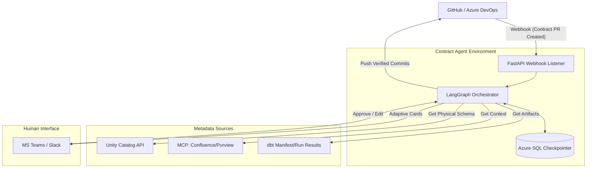

# Contract Agent Design Specification v2.0

## 1. Vision & Objectives

Contract Agent 是一个主动式的 AI 治理助手。它不只是一个静态的校验工具，而是作为一个 “语义审计员”，确保数据契约（Contract）、物理实现（Unity Catalog）与业务逻辑（Documentation）三者高度对齐。

### Key Objectives:
*   **Reference-Driven Validation:** 不再尝试解析复杂的 PySpark 代码，而是通过对比开发者在 Dev 环境中生成的物理表与 PR 中的契约声明来验证一致性。
*   **Triangle Comparison Engine:** 实现“生产标准 vs. PR 目标 vs. Dev 物理实现”的三方差集分析。
*   **ChatOps Confirmation:** 所有对仓库的修改（Commit）必须通过 Teams/Slack 的交互卡片获得人类授权。
*   **Semantic Enrichment:** 利用 MCP (Model Context Protocol) 自动从 Confluence 等文档中抓取业务背景，补全契约描述。
*   **Stateful Orchestration:** 使用外部数据库持久化 Agent 状态，支持长周期的 Human-in-the-Loop 流程。

---

## 2. Architecture Overview

---

## 3. Core Workflows (The "Triangle Comparison")

### 3.1. 契约验证流程 (The Validation Logic)
当一个修改契约（如 `schema.yml` 或 `contract.yaml`）的 PR 被创建时：
1.  **意图提取 (Desired State):** 从 PR 分支中解析最新的契约定义。
2.  **基准对比 (Current State):** 从 Main 分支提取当前生产环境的契约版本。
3.  **证据采集 (Actual State):**
    *   根据契约中的映射关系，定位开发者在 Dev Catalog 中生成的物理表。
    *   调用 Databricks API 获取该表的真实列类型、分区信息及约束。
4.  **差集分析 (Diffing):**
    *   检查“物理实现”是否满足“PR 契约”的要求。
    *   计算“PR 契约”相对于“生产环境”是否有破坏性变更（Breaking Changes）。

### 3.2. ChatOps 确认机制
Agent 不会自动在 PR 中提交修改，而是通过 MS Teams 发送交互卡片：
*   **卡片内容：** 列出三方对比结果（Schema Diff）、爆炸半径分析（下游影响）、以及从文档中自动推导的描述建议。
*   **操作：** 开发者点击 `[Approve & Commit]` 后，Agent 才会调用 Git API 将完善后的契约推送到 PR 分支。

---

## 4. System Components

### 4.1. Comparison Engine (三方对比引擎)
*   **职责：** 核心算法模块，负责对齐 YAML 声明与 UC 物理元数据。
*   **技术：** 使用 Databricks SDK 采集元数据，利用 `sqlglot` 对 DDL 约束进行标准规范化处理。

### 4.2. State Orchestrator (LangGraph + Azure SQL)
*   **职责：** 管理 Agent 的长周期状态机。
*   **持久化：** 所有的工作流状态、待处理的审批 ID 全部存储在 Azure SQL 中，解决容器重启导致的状态丢失问题。

### 4.3. Context Engine (MCP Client)
*   **职责：** 消除“治理疲劳”。
*   **行为：** 当 PR 缺少字段描述时，根据 `authoritativeDefinitions` 自动路由到 Confluence/Purview，抓取业务定义并反馈给开发者。

### 4.4. Platform Adapters (dbt & PySpark)
*   **dbt 适配：** 支持解析 `manifest.json` 和 `run_results.json`，验证 dbt test 是否在 Dev 环境通过。
*   **PySpark 适配：** 重点在于 UC 表元数据的实时抓取，通过物理表结构倒推契约的合法性。

### 4.5. Agent Observability & Packaging (MLflow)
*   **职责：** 监控“黑盒”模型，管理 Agent 的生命周期。
*   **行为：**
    *   **Tracing:** 利用 MLflow 深度记录 LangGraph 的每一个状态节点（Node）、工具调用（Tool Calling）以及 Token 消耗，以便审计 Agent 的决策过程。
    *   **Packaging:** 将 LangGraph 逻辑打包为标准的 MLflow 模型 (`pyfunc` 或 `langchain` flavor)，从而方便地一键部署到 Databricks Model Serving。

---

## 5. Technology Stack Summary

| 分类 | 推荐技术 | 选型理由 |
| :--- | :--- | :--- |
| **Agent 框架** | LangGraph | 支持复杂的、带循环的、需要持久化的 HITL 工作流。 |
| **观测与打包** | MLflow | 记录复杂的多步推理 Traces，标准化模型的生命周期与部署。 |
| **状态存储** | Azure SQL | 利用现有基础设施，提供工业级的状态一致性。 |
| **部署环境** | Azure Container Apps / Databricks Model Serving | 无服务器运行环境，高度兼容 MLflow 打包的模型。 |
| **元数据解析** | sqlglot / Databricks SDK | 静态解析 DDL 与动态获取 UC 状态相结合。 |
| **交互媒介** | Adaptive Cards (Teams) | 提供比纯文本 PR Comment 更丰富的交互体验和控制权。 |

---

## 6. Development Roadmap

*   **Phase 1 (Foundation):** 实现 FastAPI Webhook + Azure SQL 状态持久化，能够检测 PR 变更。
*   **Phase 2 (Alignment):** 实现针对 UC 元数据的抓取，完成“契约声明 vs. 物理表”的对比逻辑。
*   **Phase 3 (ChatOps):** 集成 Teams 卡片，实现“确认后提交”的闭环。
*   **Phase 4 (Context):** 接入 MCP，实现基于文档的自动化语义富化。