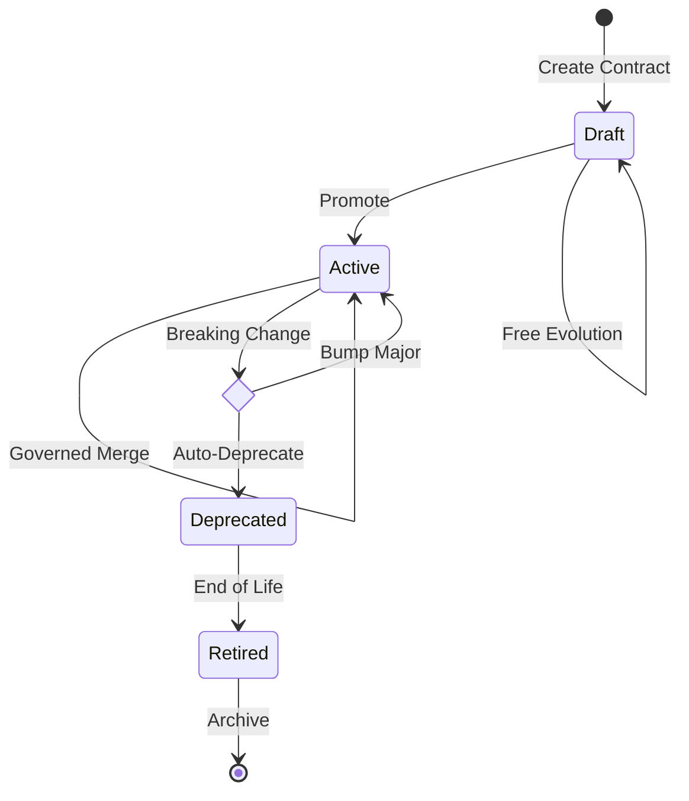

# 🏛️ ContractHub

[](https://badge.fury.io/py/contract-hub)
[](https://pypi.org/project/contract-hub/)
[](https://opensource.org/licenses/MIT)

Production-grade Lifecycle Governance for Open Data Contracts (ODCS).

Stop managing isolated YAML files. ContractHub elevates data contracts from mere format validators to enterprise-grade, lifecycle-aware infrastructure. Designed for Data Mesh and Modern Data Stack environments, it enforces deterministic merges, graph-native lineage, and CI/CD promotion for entire Data Products.


## 💡 Why ContractHub? (Beyond basic CLI tools)
While basic tools validate single-table schema syntax, ContractHub tackles the real-world chaos of data engineering: State, Evolution, and Dependencies.

* **📦 Data Product Bounding**: Group multiple tables into a single governed boundary using Folder/Schema mapping.
* **🚦 Strict Lifecycle State Machine**: Built-in rules for draft -> active -> deprecated. Active contracts cannot be silently broken.
* **🛡️ Invisible GitOps**: Deterministic merge engines that catch breaking changes (e.g., narrowing decimal precision) before they hit production.
* **🕸️ Graph-Native Lineage**: Exports contracts as Property Graphs (Paths Over Joins), enabling cross-domain impact analysis in Neo4j.

## 🚀 Quick Start (Local Sandbox)
Experience ContractHub locally without any cloud credentials. We use a local folder of SQL DDLs to simulate a Data Product.

**1. Install**
```bash
uv sync --group dev
```

**2. Initialize a Data Product from a local SQL folder**
```bash
# Point ContractHub to a folder containing your local .sql files
uv run contracthub import --format sql-folder --source ./my_sales_ddl --output ./contracts/sales/
```

**3. Simulate a Breaking Change & Merge**

Try modifying a column type in your SQL file from `DECIMAL(10,2)` to `DECIMAL(8,2)` and run the merge engine:
```bash
uv run contracthub merge --base ./contracts/sales/ --business ./prod_contracts/sales/ --output ./merged/
```
ContractHub's policy engine will instantly catch the precision reduction and block the merge unless a semantic version bump or deprecation policy is applied.

## ⚙️ Deep Dive & Architecture

```text
contracthub/
  core/
    draft_normalizer.py
    editor_contract.py
    loader.py
    validator.py
  exporters/
    sql_exporter.py
    graph_exporter.py
  lifecycle/
    merge_engine.py
    policy.py
    helpers.py
  quality/
    ge_exporter.py
    validation.py
    sql_exporter.py
  orchestrator/
    pipeline.py
  interfaces/
    cli.py
    streamlit/
      app.py
      editor/
      services/
  devops/
    pr_creator.py
    ci_cd.py
    audit.py
```

### 🚦 Strict Lifecycle State Machine



### Installation Details

```bash
# Basic setup with dev tools
uv sync --group dev

# With Azure-backed contract storage support
uv sync --group dev --extra azure

# With Graph network capabilities
uv sync --group dev --extra graph
```

### Core Components & Features

#### 1. Data Importers

ContractHub provides pure Python, Spark-free importers that register into the `datacontract-cli` importer factory.

* **Delta Importers (`delta-table`)**: Parses Delta tables. You can import multiple Delta tables into a single data contract using the `--tables` parameter containing a comma-separated list of paths.
* **SQL Importers (`sql-folder` / `delta-ddl`)**: Parses Spark/Databricks-style Delta DDL statically to import structure and foreign key relationships from DDL constraints.
* **Unity Catalog Importer (`unity`)**: Imports from Databricks Unity Catalog, including a best-effort relationship enrichment step to read Unity table metadata for foreign key constraints (single and multi-column).

#### 2. Validation & Quality Exports

* **Great Expectations (`export-ge`)**: Delegates GE suite generation to datacontract-cli while running a lightweight GE-specific preflight check. It separates contract-level quality validation from GE execution.
* **SQL Exporters (`sql_exporter.py`)**: Generates Databricks/Spark SQL deployment DDL. For Databricks targets, it adds Databricks-specific constraints natively mapped from ODCS quality rules (e.g. `ALTER COLUMN ... SET NOT NULL` for `nullValues mustBe 0`).
* **Validation**: Core validation delegates base ODCS schema checks to `datacontract-cli` and Pydantic, reserving custom validation strictly for advanced semantic constraints.

#### 3. Graph Exports & Relationship Inferencing

* **Graph Exporter**: Exports ODCS models to Directed Property Graphs (`cypher`, `json`). Enforces strict "Paths Over Joins" compliance. Junction tables (with exactly 2 foreign keys) are collapsed into single edges, and PII Sovereignty rules are automatically enforced.
* **LLM Enrichment (`enrich`)**: Uses an LLM to automatically generate missing table descriptions, column descriptions, base Great Expectations quality rules, and infer semantic relationship edges. Powered by `litellm` under the hood, natively supporting over 100 model providers including OpenAI, Azure AI Foundry, Databricks, vLLM, and Ollama. Supported modes include `infer_joins`, `label`, `describe_tables`, `describe_columns`, and `suggest_quality`.

#### 4. Merging & Lifecycle Governance

* **Merge Engine (`merge`)**: Safely merges technical source updates into an existing, governed contract without overwriting manual business edits.
* **Lifecycle Governance**: Root contract `id` is immutable after creation. Root contract `version` is release-managed and never automatically updated by standard importer/merge runs.
* **Streamlit UI**: ContractHub includes a Streamlit app to serve as a presentation layer for interactive contract editing, fully decoupled from the core business logic.

#### 5. Storage & Access

Contract catalog storage supports:
* Local filesystem paths
* ADLS2 paths (`abfs://`, `abfss://`, or `https://<account>.dfs.core.windows.net/...`)
* Databricks Unity Catalog volume paths (`/Volumes/...`, `dbfs:/Volumes/...`)

*Note: ADLS2 access is SDK-based and uses `CONTRACTHUB_ADLS_BEARER_TOKEN` or `azure.identity.DefaultAzureCredential`. SAS URL authentication is not supported.*

### CLI Reference

The ContractHub CLI offers commands for the full contract lifecycle:

**Setup & Environment**
```bash
contracthub setup
```

**Importing Data Contracts**
```bash
# Import from Delta SQL DDL
contracthub import --format delta-ddl --source ./sql/orders --output ./contracts/orders.yaml

# Import from standard SQL
contracthub import --format sql-folder --source ./ddl/orders.sql --output ./contracts/orders.yaml

# Import multiple Delta Tables from ADLS
# Includes `--azure-auth` to automatically fetch ADLS OAuth token via azure-identity DefaultAzureCredential
contracthub import --format delta-table \
  --source abfss://container@acct.dfs.core.windows.net/orders \
  --tables abfss://container@acct.dfs.core.windows.net/payments \
  --azure-auth \
  --output ./contracts/finance.yaml

# Import from Unity Catalog
contracthub import --format unity --source main.silver.orders \
  --workspace-url https://adb.example --token $DATABRICKS_TOKEN \
  --output ./contracts/orders.yaml
```

**Merging & Enrichment**
```bash
# Merge a base contract with business modifications
contracthub merge --base ./generated.yaml --business ./contracts/orders.yaml --output ./contracts/orders.merged.yaml

# Run dry run plan of changes
contracthub plan --source ./generated.yaml --base ./contracts/orders.yaml

# Configure your LLM Provider (Examples)
export LLM_MODEL_NAME="gpt-4o"
export LLM_API_KEY="sk-..."

# For Azure AI Foundry
# export LLM_MODEL_NAME="azure/gpt-4o"
# export LLM_API_KEY="azure-key"
# export LLM_BASE_URL="https://your-endpoint.openai.azure.com/"

# Enrich contract metadata via LLM (e.g. generate missing descriptions)
contracthub enrich --contract ./contracts/orders.yaml --mode describe_columns --concurrency 2
contracthub enrich --contract ./contracts/orders.yaml --mode suggest_quality --concurrency 2
```

**Exporting Artifacts**
```bash
# Export Great Expectations Suite
contracthub export-ge --contract ./contracts/orders.yaml --output ./artifacts/orders_suite.json

# Export to Graph formats (using datacontract-cli wrapper)
datacontract export --format graph --export-args '{"format": "cypher"}' ./contracts/orders.yaml
datacontract export --format graph --export-args '{"format": "json"}' ./contracts/orders.yaml
```

**CI/CD & DevOps (PRs & Releases)**
```bash
# Single Contract PR Creation
contracthub create-pr --organization org --project proj --repository-id repo --pat-token $ADO_PAT \
  --repo-path . --source-branch contracthub/update-orders --target-branch main \
  --commit-message "Update orders contract" --title "Update orders contract" --description "Automated update"

# Classify contract bump required for a feature change
contracthub release classify --base ./contracts/orders.main.yaml --candidate ./contracts/orders.feature.yaml

# Prepare a release version candidate
contracthub release prepare --base ./contracts/orders.main.yaml --candidate ./contracts/orders.release.yaml \
  --release-tag orders/v1.2.0 --output ./artifacts/orders.promoted.yaml

# Open a PR for a promoted release candidate
contracthub release create-pr --base ./contracts/orders.main.yaml --candidate ./contracts/orders.release.yaml \
  --release-tag orders/v1.2.0 --repo-path . --contract-path contracts/orders.yaml \
  --source-branch release/orders-v1.2.0 --target-branch release \
  --organization org --project proj --repository-id repo --pat-token $ADO_PAT --push

# Multi-Contract (Repo-level) Release Management
contracthub release classify-repo --base-root ./contracts-main --candidate-root ./contracts-feature
contracthub release build-manifest --base-root ./contracts-main --candidate-root ./contracts-feature \
  --output ./artifacts/release_manifest.json
contracthub release create-prs --manifest ./artifacts/release_manifest.json --repo-path . \
  --organization org --project proj --repository-id repo --pat-token $ADO_PAT --push
```

### SDK Usage

ContractHub functionality can be executed via its pure-Python API.

```python
from datacontract.data_contract import DataContract
from contracthub.lifecycle import ContractMergeEngine
from contracthub.quality import GreatExpectationsExporter
from contracthub.importers.unity_importer import import_unity_contract
from contracthub.tools.enricher import ContractEnricher
from azure.identity import DefaultAzureCredential
import os

# 1. Import from a source
# Setting Azure token natively for datacontract-cli ingestion via ADLS
os.environ["CONTRACTHUB_ADLS_BEARER_TOKEN"] = DefaultAzureCredential().get_token("https://storage.azure.com/.default").token

contract = DataContract.import_from_source(
    format="delta-ddl",
    source="./sql/orders"
)

# 2. Merge with an existing governed contract
merged = ContractMergeEngine().merge(
    base_contract=contract,
    business_contract=DataContract(data_contract_file="./contracts/orders.yaml").data_contract
)

# 3. Export to Great Expectations Suite
GreatExpectationsExporter().export_to_path(
    contract=merged.contract,
    output_path="./artifacts/orders_suite.json",
    schema_name="all"
)

# 4. Importing from Unity Catalog Programmatically
unity_contract = import_unity_contract(
    table_fqn="main.silver.orders",
    workspace_url="https://adb.example",
    token="YOUR_TOKEN"
)

# 5. Enriching via LLM (supports modes 'label', 'infer_joins', 'describe_tables', 'describe_columns', 'suggest_quality')
# Ensure litellm environment variables are set (LLM_MODEL_NAME, LLM_API_KEY)
enricher = ContractEnricher()
enricher.process(contract_path="./contracts/orders.yaml", max_workers=2, mode="suggest_quality")
```

### CI/CD Flow & Releases

#### Feature -> Main

Use per-contract bump classification without changing contract versions:

```bash
contracthub release classify \
  --base ./contracts/orders.main.yaml \
  --candidate ./contracts/orders.feature.yaml
```

For multi-contract repos:

```bash
contracthub release classify-repo \
  --base-root ./contracts-main \
  --candidate-root ./contracts-feature
```

#### Main -> Release

Build an editable per-contract manifest, review or adjust tags, then create release PRs:

```bash
# Generate manifest
contracthub release build-manifest \
  --base-root ./contracts-main \
  --candidate-root ./contracts-release \
  --output ./artifacts/release_manifest.json

# Review the manifest, then execute PR creation
contracthub release create-prs \
  --manifest ./artifacts/release_manifest.json \
  --repo-path . \
  --organization org \
  --project proj \
  --repository-id repo \
  --pat-token $ADO_PAT \
  --push
```

**Important Notes for CI/CD**:
* The generated manifest is per contract. Review it before creating PRs, especially for added/removed contracts or required bump adjustments.
* Reference examples for CI workflows live under:
  - `examples/release/release-manifest.example.json`
  - `examples/ci/pr-check.example.sh`
  - `examples/ci/release.example.sh`
  - `examples/azure-devops/contracthub-pr-validation.yml`
  - `examples/azure-devops/contracthub-release.yml`

## 🗺️ Roadmap & Contributing
ContractHub is actively evolving. We are looking for community contributions in the following areas:

- [ ] **Zero-Setup Sandbox**: Add native DuckDB/SQLite providers for frictionless local CI/CD testing.
- [ ] **DevOps UX**: Introduce Lite Mode for trunk-based development (auto tag/bump on main merge).
- [ ] **CLI Actions**: Add atomic state commands like `contracthub promote <name>` and `contracthub deprecate <property>`.
- [ ] **PR Governance Reporter**: Translate backend LifecycleError traces into clean, human-readable Markdown comments for GitHub Actions.
- [ ] **Physical State Sync**: Sync lifecycleStatus and version directly into Databricks Unity Catalog column comments.
- [ ] **Cross-Domain Validation**: Shift-left graph validations to block cross-contract dependency breaks during CI.

We welcome PRs! Check out our Contributing Guide.
