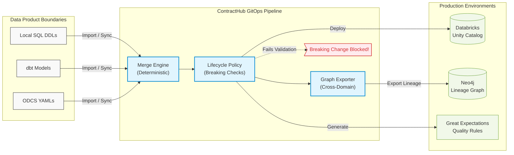
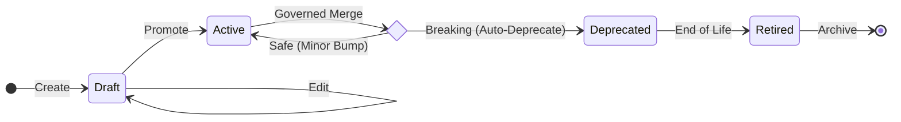

# 🏛️ ContractHub

[](https://badge.fury.io/py/contract-hub)
[](https://pypi.org/project/contract-hub/)
[](https://opensource.org/licenses/MIT)

**Data Contract Management & Governance for the Modern Data Stack (ODCS v3.0+)**

Stop managing isolated YAML files. ContractHub elevates **data contracts** from mere format validators to enterprise-grade, lifecycle-aware infrastructure. Designed for **Data Mesh** architectures, **Data Engineering** teams, and **Data Product** owners, it provides a seamless **GitOps** pipeline. By enforcing deterministic schema merges, semantic breaking-change policies, and **graph-native data lineage**, ContractHub ensures reliable data integration across platforms like Databricks Unity Catalog, Snowflake, and Great Expectations. All powered by a dynamic configuration system that eliminates hardcoded CLI credentials.



## 💡 Why ContractHub? (Beyond basic CLI tools)
While basic tools validate single-table schema syntax, ContractHub tackles the real-world chaos of data engineering: State, Evolution, and Dependencies.

* **📦 Data Product Bounding**: Group multiple tables into a single governed boundary using Folder/Schema mapping.
* **🚦 Strict Lifecycle State Machine**: Built-in rules for draft -> active -> deprecated. Active contracts cannot be silently broken.
* **🛡️ Invisible GitOps**: Deterministic merge engines that catch breaking changes (e.g., narrowing decimal precision) before they hit production.
* **🕸️ Graph-Native Lineage**: Exports contracts as Property Graphs (Paths Over Joins), enabling cross-domain impact analysis in Neo4j.

## 🤝 ContractHub vs. Unity Catalog (Why both?)
If you are already using Databricks Unity Catalog (UC), you might wonder why you need Data Contracts or ContractHub. Unity Catalog is a world-class technical catalog and governance engine for your active data platform, but ContractHub complements it by **shifting governance left**:

1. **Catch Breaks Before Production (GitOps)**: UC manages state *after* code is deployed. ContractHub acts in your Git CI/CD pipeline. If a developer drops a column, ContractHub's policy engine catches it in the Pull Request and blocks the merge, preventing the breakage from ever reaching UC.
2. **Platform Agnostic Semantic Layer**: UC is specific to Databricks. ContractHub uses the Open Data Contract Standard (ODCS) which can export not just to UC, but simultaneously to Great Expectations (quality), Neo4j (lineage), Snowflake, and Kafka. This breaks vendor lock-in and allows multi-platform data sharing.
3. **Business Semantics over Technical Metadata**: While UC knows your tables and columns, ContractHub bounds multiple tables into a logical "Data Product". It captures SLAs, data granularity, rich business descriptions, and semantic multi-table relationships that go beyond physical constraints.
4. **Strict Lifecycle Versioning**: ContractHub enforces a strict state machine (`Draft` -> `Active` -> `Deprecated`). A v1.0.0 contract in UC cannot be gracefully deprecated with a timeline without external tooling—ContractHub orchestrates this lifecycle natively.

## 🚀 Quick Start (Local Sandbox)
Experience ContractHub locally without any cloud credentials. We use a local folder of SQL DDLs to simulate a Data Product.

**1. Install**
```bash
uv sync --group dev
```

**2. Initialize a Data Product from a local SQL folder**
```bash
# Point ContractHub to a folder containing your local .sql files
uv run contracthub import --format sql-folder --source ./my_sales_ddl --output ./contracts/sales/
```

**3. Simulate a Breaking Change & Merge**

Try modifying a column type in your SQL file from `DECIMAL(10,2)` to `DECIMAL(8,2)` and run the merge engine:
```bash
uv run contracthub merge --base ./contracts/sales/ --business ./prod_contracts/sales/ --output ./merged/
```
ContractHub's policy engine will instantly catch the precision reduction and block the merge unless a semantic version bump or deprecation policy is applied.

## ⚙️ Deep Dive & Architecture

```text
contracthub/
  core/
    draft_normalizer.py
    editor_contract.py
    loader.py
    validator.py
  exporters/
    sql_exporter.py
    graph_exporter.py
  lifecycle/
    merge_engine.py
    policy.py
    helpers.py
  quality/
    ge_exporter.py
    validation.py
    sql_exporter.py
  orchestrator/
    pipeline.py
  tools/
    agent_toolkit.py     # Agent Tool SDK (framework-agnostic)
  interfaces/
    cli.py
    streamlit/
      app.py
      editor/
      services/
  devops/
    pr_creator.py
    ci_cd.py
    audit.py
```

### 🚦 Strict Lifecycle State Machine



### Installation Details

ContractHub is designed to be lightweight by default. Core functionality (like basic GitOps and schema validation) requires minimal dependencies. You can install specific feature sets using optional extras:

| Extra Group | Description | Key Dependencies Installed |
|---|---|---|
| **`core`** | (Default) Basic schema validation and GitOps engine. | `pydantic`, `PyYAML`, `datacontract-cli` |
| **`delta`** | Required for `delta-table` and `delta-ddl` format importers. | `deltalake`, `pyarrow`, `pandas` |
| **`sql`** | Required for SQL dialect parsing and `sql-folder` imports. | `SQLAlchemy`, `sqlglot` |
| **`databricks`**| Required for Unity Catalog integration. | `databricks-sql-connector`, `pyspark` |
| **`azure`** | Required for ADLS2 (`abfss://`) native storage access. | `azure-identity`, `azure-storage-file-datalake` |
| **`s3`** | Required for Amazon S3 (`s3://`) native storage access. | `boto3`, `s3fs` |
| **`quality`** | Required for exporting Great Expectations (`export-ge`). | `great_expectations`, `pandas` |
| **`llm`** | Required for LLM Semantic Enrichment (`enrich`). | `openai`, `litellm` |
| **`graph`** | Required for Neo4j/Cypher Graph exports. | `networkx` |
| **`dbt`** | Required for exporting dbt models. | `datacontract-cli[dbt]` |
| **`tui`** | Required to launch the interactive graphical interface. | `textual` |
| **`all`** | Installs all of the above for a complete environment. | *All optional dependencies* |

**Installation Examples:**
```bash
# Basic installation (Core only)
pip install contract-hub

# Install with TUI and Unity Catalog support
pip install "contract-hub[tui,databricks]"

# Install EVERYTHING
pip install "contract-hub[all]"
```

*If you are using `uv` for local development:*
```bash
# Sync all dependencies including dev tools and all extras
uv sync --all-extras --group dev --frozen
```

### Core Components & Features

#### 1. Data Importers

ContractHub provides pure Python, Spark-free importers that register into the `datacontract-cli` importer factory.

* **Delta Importers (`delta-table`)**: Parses Delta tables. You can import multiple Delta tables into a single data contract using the `--tables` parameter containing a comma-separated list of paths.
* **SQL Importers (`sql-folder` / `delta-ddl`)**: Parses Spark/Databricks-style Delta DDL statically to import structure and foreign key relationships from DDL constraints.
* **Unity Catalog Importer (`unity`)**: Imports from Databricks Unity Catalog. Securely fetches credentials (e.g. `workspace_url`, `token`, or `profile`) from `.contracthub.yaml`. Includes a best-effort relationship enrichment step to read Unity table metadata for foreign key constraints.

#### 2. Validation & Quality Exports

* **Great Expectations (`export-ge`)**: Delegates GE suite generation to datacontract-cli while running a lightweight GE-specific preflight check. It separates contract-level quality validation from GE execution.
* **SQL Exporters (`sql_exporter.py`)**: Generates Databricks/Spark SQL deployment DDL. For Databricks targets, it adds Databricks-specific constraints natively mapped from ODCS quality rules (e.g. `ALTER COLUMN ... SET NOT NULL` for `nullValues mustBe 0`).
* **Validation**: Core validation delegates base ODCS schema checks to `datacontract-cli` and Pydantic, reserving custom validation strictly for advanced semantic constraints.

#### 3. Graph Exports & Relationship Inferencing

* **Graph Exporter**: Exports ODCS models to Directed Property Graphs (`cypher`, `json`). Enforces strict "Paths Over Joins" compliance. Junction tables (with exactly 2 foreign keys) are collapsed into single edges, and PII Sovereignty rules are automatically enforced.

#### 4. Merging & Lifecycle Governance

* **Merge Engine (`merge`)**: Safely merges technical source updates into an existing, governed contract without overwriting manual business edits.
* **Lifecycle Governance**: Root contract `id` is immutable after creation. Root contract `version` is release-managed and never automatically updated by standard importer/merge runs.
* **Streamlit UI**: ContractHub includes a Streamlit app to serve as a presentation layer for interactive contract editing, fully decoupled from the core business logic.

#### 5. Storage & Access

Contract catalog storage supports:
* Local filesystem paths
* ADLS2 paths (`abfs://`, `abfss://`, or `https://<account>.dfs.core.windows.net/...`)
* Databricks Unity Catalog volume paths (`/Volumes/...`, `dbfs:/Volumes/...`)

*Note: ADLS2 access is SDK-based and uses `CONTRACTHUB_ADLS_BEARER_TOKEN` or `azure.identity.DefaultAzureCredential`. SAS URL authentication is not supported.*

### CLI Reference

The ContractHub CLI offers commands for the full contract lifecycle:

**Setup & Environment**
```bash
# Initialize a local configuration file (.contracthub.yaml) in the current directory.
# This configures your local CLI/TUI environment and eliminates the need for environment variables.
contracthub init

# Bootstrap your git repository with CI/CD pipelines and GitOps templates.
# Use this when setting up a new centralized data contract repository for the first time.
contracthub init --scaffold
```

The `--scaffold` flag will bootstrap a brand new Git repository with standard CI/CD and GitOps templates. It automatically generates:
- **Folder Structure**: Creates the default `contracts` directory.
- **CI/CD Pipelines**: Creates a `.github/workflows/contract-check.yaml` (GitHub), `.gitlab/ci/contract-check.yml` (GitLab), or `azure-pipelines.yml` (Azure DevOps) based on the `git.provider` setting in your `.contracthub.yaml`.
- **Sample Contract**: Generates a dummy `contracts/sample.yaml` to help you get started.

The `contracthub init` command will generate a `.contracthub.yaml` file that looks like this:
```yaml
azure:
  auth_method: cli
  scope: https://storage.azure.com/.default
git:
  provider: azure
  organization: your-organization
  project: your-project
  repository_id: your-repo-id
core:
  enforce_lifecycle: true
llm:
  model_name: gpt-4-turbo
  api_key: ""
  base_url: ""
databricks:
  profile: "default"
  # workspace_url: "https://adb-xxx.azuredatabricks.net"
  # token: "dapi..."
```
This configuration is automatically picked up by the CLI and the SDK. 

**Using the SDK (Overriding Configuration)**
If you are building your own tools or CLI on top of ContractHub, you don't have to rely on the `.contracthub.yaml` file. You can dynamically inject or override configuration using the `ConfigManager` singleton:

```python
from contracthub.core.config import config_manager
from contracthub.core.loader import ContractLoader

# 1. Inject configuration via a Python Dictionary (Overrides YAML)
config_manager.update_config({
    "azure": {
        "auth_method": "managed_identity"
    },
    "databricks": {
        "workspace_url": "https://adb-1234.azuredatabricks.net",
        "token": "dapi..."
    }
})

# 2. Or load from a custom path if your tool uses a different config file
# config_manager.load_from_path("/etc/my-custom-tool/config.yaml")

# Now any ContractHub operations will use your injected config
loader = ContractLoader()
```

**Reusing the Textual TUI (`contracthub tui`)**
The ContractHub TUI is designed to dynamically render forms based on python's standard `argparse.ArgumentParser`. If you are building a custom CLI that extends ContractHub, you can get a free graphical interface for your commands.

The TUI automatically:
- Recursively flattens deeply nested sub-commands into a clean sidebar.
- Renders `argparse._ArgumentGroup`s into elegant `Collapsible` panels, hiding irrelevant arguments (e.g. keeping `--workspace-url` hidden unless expanding Unity Catalog options).

Simply pass your custom parser into the `ContractHubTUI` class:

```python
import argparse
from contracthub.tui.app import ContractHubTUI

# 1. Define your custom CLI
my_parser = argparse.ArgumentParser(prog="my_custom_tool")
subparsers = my_parser.add_subparsers(dest="command")
sync_cmd = subparsers.add_parser("sync-remote")
sync_cmd.add_argument("--force", action="store_true")

# 2. Launch the TUI dynamically generated from your parser!
app = ContractHubTUI(cli_parser=my_parser, excluded_commands=["hidden_cmd"])
app.run()
```

**Importing Data Contracts**
```bash
# Import from Delta SQL DDL
contracthub import --format delta-ddl --source ./sql/orders --output ./contracts/orders.yaml

# Import from standard SQL
contracthub import --format sql-folder --source ./ddl/orders.sql --output ./contracts/orders.yaml

# Import multiple Delta Tables from ADLS
# Automatically fetches ADLS OAuth token via azure.auth_method (e.g. managed_identity or cli) in config
contracthub import --format delta-table \
  --source abfss://container@acct.dfs.core.windows.net/orders \
  --tables abfss://container@acct.dfs.core.windows.net/payments \
  --output ./contracts/finance.yaml

# Import from Unity Catalog
# Automatically uses databricks.profile or token from .contracthub.yaml
contracthub import --format unity --source main.silver.orders \
  --output ./contracts/orders.yaml
```

**Merging**
```bash
# Merge a base contract with business modifications
contracthub merge --base ./generated.yaml --business ./contracts/orders.yaml --output ./contracts/orders.merged.yaml

# Run dry run plan of changes
contracthub plan --type unity --source main.silver.orders --base ./contracts/orders.yaml
```

**Exporting Artifacts**
```bash
# Export Great Expectations Suite
contracthub export-ge --contract ./contracts/orders.yaml --output ./artifacts/orders_suite.json

# Export to Graph formats (using datacontract-cli wrapper)
datacontract export --format graph --export-args '{"format": "cypher"}' ./contracts/orders.yaml
datacontract export --format graph --export-args '{"format": "json"}' ./contracts/orders.yaml
```

**CI/CD & DevOps (PRs & Releases)**
```bash
# Single Contract PR Creation (reads org/project/repo from config)
contracthub create-pr --pat-token $ADO_PAT \
  --repo-path . --source-branch contracthub/update-orders --target-branch main \
  --commit-message "Update orders contract" --title "Update orders contract" --description "Automated update"

# Classify contract bump required for a feature change
contracthub release classify --base ./contracts/orders.main.yaml --candidate ./contracts/orders.feature.yaml

# Prepare a release version candidate
contracthub release prepare --base ./contracts/orders.main.yaml --candidate ./contracts/orders.release.yaml \
  --release-tag orders/v1.2.0 --output ./artifacts/orders.promoted.yaml

# Open a PR for a promoted release candidate (reads org/project/repo from config)
contracthub release create-pr --base ./contracts/orders.main.yaml --candidate ./contracts/orders.release.yaml \
  --release-tag orders/v1.2.0 --repo-path . --contract-path contracts/orders.yaml \
  --source-branch release/orders-v1.2.0 --target-branch release \
  --pat-token $ADO_PAT --push

# Multi-Contract (Repo-level) Release Management
contracthub release classify-repo --base-root ./contracts-main --candidate-root ./contracts-feature
contracthub release build-manifest --base-root ./contracts-main --candidate-root ./contracts-feature \
  --output ./artifacts/release_manifest.json
contracthub release create-prs --manifest ./artifacts/release_manifest.json --repo-path . \
  --organization org --project proj --repository-id repo --pat-token $ADO_PAT --push
```

### SDK Usage

ContractHub functionality can be executed via its pure-Python API.

```python
from datacontract.data_contract import DataContract
from contracthub.lifecycle import ContractMergeEngine
from contracthub.quality import GreatExpectationsExporter
from contracthub.importers.unity_importer import import_unity_contract
from contracthub.tools.enricher import ContractEnricher
from azure.identity import DefaultAzureCredential
import os

# 1. Import from a source
# Setting Azure token natively for datacontract-cli ingestion via ADLS
os.environ["CONTRACTHUB_ADLS_BEARER_TOKEN"] = DefaultAzureCredential().get_token("https://storage.azure.com/.default").token

contract = DataContract.import_from_source(
    format="delta-ddl",
    source="./sql/orders"
)

# 2. Merge with an existing governed contract
merged = ContractMergeEngine().merge(
    base_contract=contract,
    business_contract=DataContract(data_contract_file="./contracts/orders.yaml").data_contract
)

# 3. Export to Great Expectations Suite
GreatExpectationsExporter().export_to_path(
    contract=merged.contract,
    output_path="./artifacts/orders_suite.json",
    schema_name="all"
)

# 4. Importing from Unity Catalog Programmatically
unity_contract = import_unity_contract(
    table_fqn="main.silver.orders",
    workspace_url="https://adb.example",
    token="YOUR_TOKEN"
)
```

#### 6. Agent Toolkit (Tool SDK)

ContractHub exposes a **framework-agnostic Tool SDK** (`contracthub.tools.agent_toolkit`) for use by AI agents (ContractHub-Agent, LangGraph, CrewAI, or any custom agent framework). All tools return a uniform `ToolResult` type — the caller never needs to handle ContractHub-specific exceptions.

| Tool | Description |
|------|-------------|
| `load_contract(path)` | Load an ODCS contract and return it as a dict |
| `validate_contract(path)` | Validate ODCS syntax + quality rules; returns `{valid, issues}` |
| `analyze_changes(base_path, modified_path)` | Detect breaking changes, conflicts, and deprecations between two contract versions |
| `export_sql(path, ...)` | Generate Spark / Databricks DDL |
| `export_graph(path, format)` | Export a Cypher or JSON property graph |

```python
from contracthub.tools import (
    load_contract,
    validate_contract,
    analyze_changes,
    export_sql,
    export_graph,
)

# Every tool returns ToolResult(success, data, error) — no exceptions to catch
result = validate_contract("contracts/orders.yaml")
if result.success and not result.data["valid"]:
    for issue in result.data["issues"]:
        print(f"[{issue['severity']}] {issue['path']}: {issue['message']}")

# Compare existing contract vs proposed modification
result = analyze_changes(
    base_contract_path="contracts/orders.yaml",
    modified_contract_path="drafts/alice/orders.yaml",
)
if result.success:
    breaking = result.data["breaking_changes"]
    # Surface breaking_changes in a HITL review proposal

# Generate Databricks DDL
result = export_sql(
    "contracts/orders.yaml",
    sql_server_type="databricks",
    unity_catalog="prod",
    unity_schema="sales",
)
if result.success:
    print(result.data["ddl"])
```

> **Framework adapters**: The toolkit is intentionally plain Python. To use it with LangChain, wrap each function with `@tool`; for LangGraph or CrewAI, register the functions as tools in your agent's tool list. No ContractHub-side changes are needed.

### CI/CD Flow & Releases

#### Feature -> Main

Use per-contract bump classification without changing contract versions:

```bash
contracthub release classify \
  --base ./contracts/orders.main.yaml \
  --candidate ./contracts/orders.feature.yaml
```

For multi-contract repos:

```bash
contracthub release classify-repo \
  --base-root ./contracts-main \
  --candidate-root ./contracts-feature
```

#### Main -> Release

Build an editable per-contract manifest, review or adjust tags, then create release PRs:

```bash
# Generate manifest
contracthub release build-manifest \
  --base-root ./contracts-main \
  --candidate-root ./contracts-release \
  --output ./artifacts/release_manifest.json

# Review the manifest, then execute PR creation
contracthub release create-prs \
  --manifest ./artifacts/release_manifest.json \
  --repo-path . \
  --organization org \
  --project proj \
  --repository-id repo \
  --pat-token $ADO_PAT \
  --push
```

**Important Notes for CI/CD**:
* The generated manifest is per contract. Review it before creating PRs, especially for added/removed contracts or required bump adjustments.
* Reference examples for CI workflows live under:
  - `examples/release/release-manifest.example.json`
  - `examples/ci/pr-check.example.sh`
  - `examples/ci/release.example.sh`
  - `examples/azure-devops/contracthub-pr-validation.yml`
  - `examples/azure-devops/contracthub-release.yml`

## 🗺️ Roadmap & Contributing
ContractHub is actively evolving. We are looking for community contributions in the following areas:

- [ ] **Zero-Setup Sandbox**: Add native DuckDB/SQLite providers for frictionless local CI/CD testing.
- [ ] **DevOps UX**: Introduce Lite Mode for trunk-based development (auto tag/bump on main merge).
- [ ] **CLI Actions**: Add atomic state commands like `contracthub promote <name>` and `contracthub deprecate <property>`.
- [ ] **PR Governance Reporter**: Translate backend LifecycleError traces into clean, human-readable Markdown comments for GitHub Actions.
- [ ] **Physical State Sync**: Sync lifecycleStatus and version directly into Databricks Unity Catalog column comments.
- [ ] **Cross-Domain Validation**: Shift-left graph validations to block cross-contract dependency breaks during CI.

We welcome PRs! Check out our Contributing Guide.
